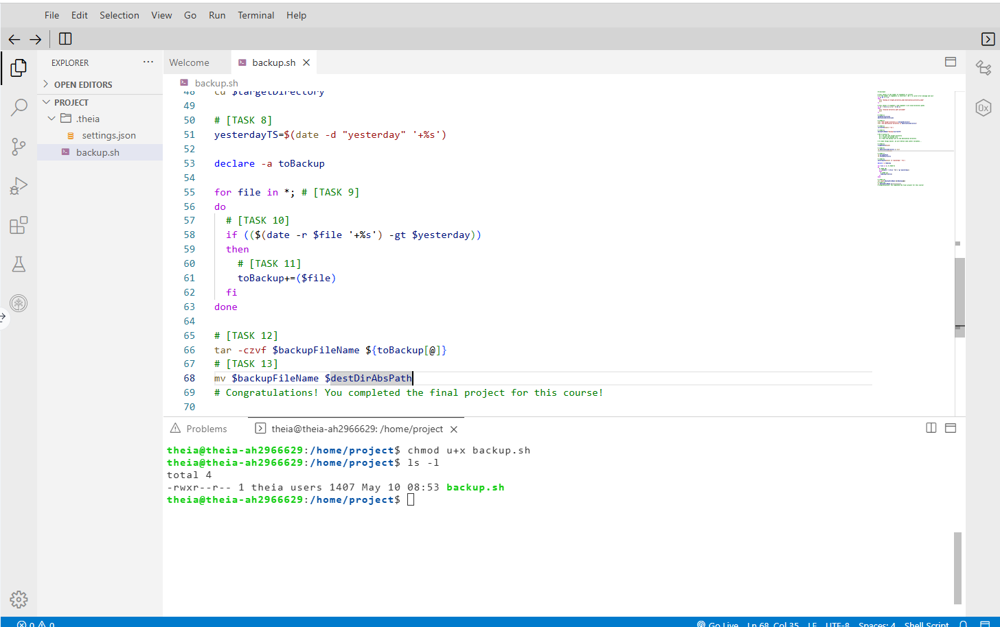
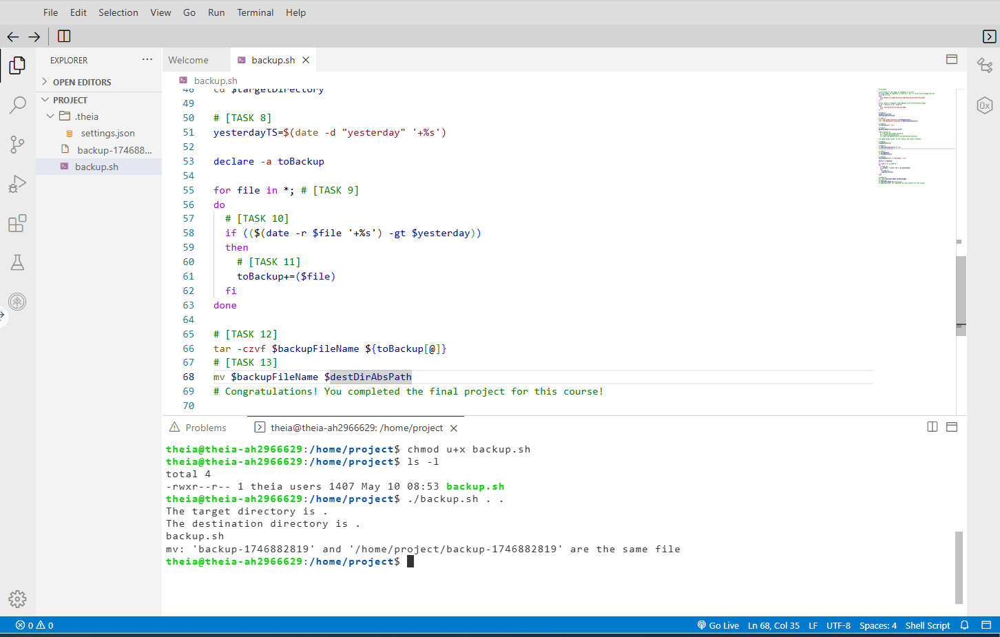

# backup.sh – Daily Secure Backup Script
Daily automated backup script using bash script and cron job.
`backup.sh` automatically archives **files modified in the last 24 hours** and
drops the compressed backup in a safe destination folder.

## Features
* Pure Bash (no external libs)
* Time-stamped archive name: `backup-<UNIX_TS>.tar.gz`
* Works with any source/destination paths
* Designed for daily execution via `cron`

## Usage
```bash
chmod +x backup.sh
./backup.sh <source_dir> <destination_dir>
# example
./backup.sh /etc/secure /var/backups
```
## Quick start
```bash
git clone https://github.com/Aly-Habib/automated-backup-using-bash-and-cron-job.git
cd automated-backup-using-bash-and-cron-job
```

## Schedule with cron
Run the following command to open cron job file to edit
```bash
crontab -e
```
Then, add the following line and save the file.
```bash
0 12 * * * /path/to/backup.sh   # daily at 12:00
```

<p align="center"
  
</p>

<p align="center"
  
</p>
